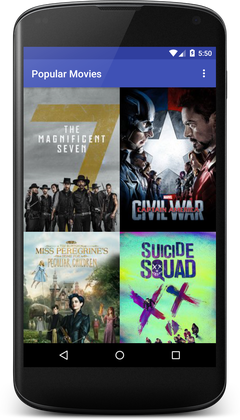
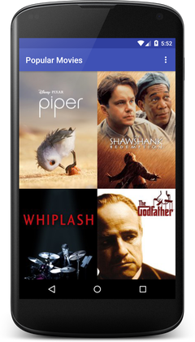
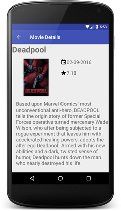

# Popular Movies


**Popular Movies** is an Android app that allows you to browse popular and highly rated movie posters and get details about that movie.





## Installation

[Create an account](https://www.themoviedb.org/account/signup.) at [themoviedb.org](https://www.themoviedb.org/) and request an API key.

Put your api key in a variable named ```TMDB_API_KEY ``` in  ```gradle.properties``` 
```
TMDB_API_KEY = "YourAPIKeyGoesHere"
```

## Stage 1 


* [x] Movies are displayed in the main layout via a grid of their corresponding movie poster thumbnails.
* [x] UI contains an element (i.e a spinner or settings menu) to toggle the sort order of the movies by: most popular, highest rated.
* [x] When a user changes the sort criteria (“most popular and highest rated”) the main view gets updated correctly.
* [x] UI contains a screen for displaying the details for a selected movie.
* [x] When a movie poster thumbnail is selected, the movie details screen is launched.
* [x] Movie details layout contains title, release date, movie poster, vote average, and plot synopsis.
* [x] In a background thread, app queries the /movie/popular or /movie/top_rated API for the sort criteria specified in the settings menu.

## Stage 2


* [ ] Movie Details layout contains a section for displaying trailer videos and user reviews.
* [ ] Tablet UI uses a Master-Detail layout implemented using fragments. The left fragment is for discovering movies. The right fragment displays the movie details view for the currently selected movie.
* [ ] When a trailer is selected, app uses an Intent to launch the trailer.
* [ ] In the movies detail screen, a user can tap a button(for example, a star) to mark it as a Favorite.
* [ ] App requests for related videos for a selected movie via the /movie/{id}/videos endpoint in a background thread and displays those details when the user selects a movie.
* [ ] App requests for user reviews for a selected movie via the /movie/{id}/reviews endpoint in a background thread and displays those details when the user selects a movie.
* [ ] App saves a "Favorited" movie to SharedPreferences or a database using the movie’s id.
* [ ] When the "favorites" setting option is selected, the main view displays the entire favorites collection based on movie IDs stored in SharedPreferences or a database.

## License

    Copyright [2016] [Erik Cox]

    Licensed under the Apache License, Version 2.0 (the "License");
    you may not use this file except in compliance with the License.
    You may obtain a copy of the License at

        http://www.apache.org/licenses/LICENSE-2.0

    Unless required by applicable law or agreed to in writing, software
    distributed under the License is distributed on an "AS IS" BASIS,
    WITHOUT WARRANTIES OR CONDITIONS OF ANY KIND, either express or implied.
    See the License for the specific language governing permissions and
    limitations under the License.